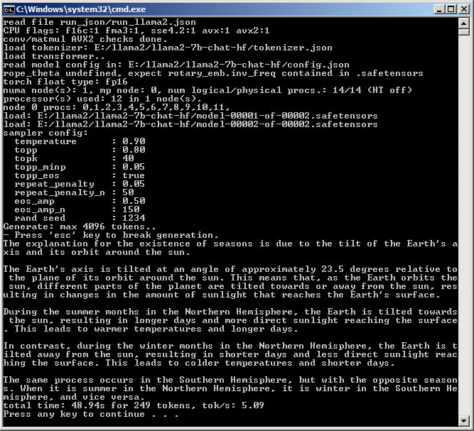
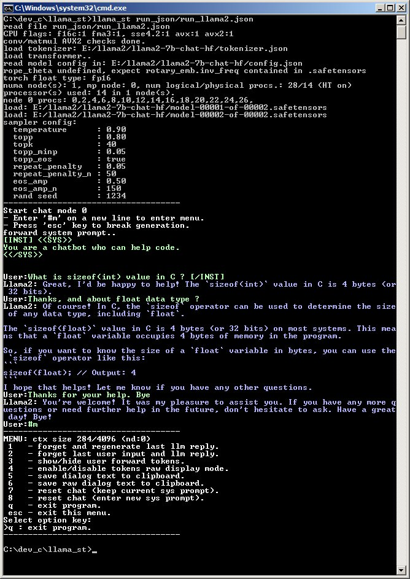

## llama_st

This program has the function of inferring LLMs based on the llama transformer with direct load of models from .safetensors files.

It was started on the basis of [llama2.c](https://github.com/karpathy/llama2.c) by [karpathy](https://github.com/karpathy) and is also entirely in C.
It does not require any external libraries and is intended for inference using only the CPU.

Support for the .safetensors format allows loading LLM models without requiring the creation of an intermediate format file, saving significant disk space.
The LLM vocabulary file is also directly loaded from the .json format.

Loading a model can then be done using only the following files:
- config.json
- tokenizer.json
- model.safetensors or model-000xx-of-000xx.safetensors file list.

This allows not to require a conversion process using python nor to have python installed on the machine.

In addition to the safetensors support, the following features have been added.

- 1/ SIMD optimizations.
- 2/ Optimizations for NUMA architectures.
- 3/ Conversion of weight formats at loading to reduce memory usage.

`1:` SIMD optimizations applies to a single vector * matrix multiplication function.
This function supports float formats F32, F16, BF16, F12, F8
Support is made for SSE, AVX, AVX2.
SSE support allows the use of old processors that do not support AVX2. (xeon E5 V2, opterons 62xx, etc.)

`2:` Optimization for numa takes advantage of the improved memory bandwidth of multi-socket hardware.
When loading, weight data are distributed in the memory of the numa nodes associated with the cpu cores of each thread.
Multi-threading uses OpenMP.

`3:` The weight format conversion allows to reduce the memory required to run a model.
The F12 format (E4M7, 12 bits per float) allows to convert the BF16 format with small loss (1) and produce a performance gain if AVX2 is supported.
In particular, it allows testing 70B-80B models with "only" 128 GB of memory, or running 7B/8B models with 16 GB.
The F8 format (E4M3, 8 bits) is the fastest but produces a significant loss of precision (2).

(1) All BF16 values except 0 can be converted identically.
(2) It apparently allows to run the models correctly. Some models cannot be converted to F8.
The impact of these encodings on perplexity remains to be evaluated.

### Model configuration.

The run configuration of a model uses a json format file whose name is passed on the command line.

This file is opened in an 'extended json' mode that allows to add C/C++ comments and to concatenate strings.
Concatenation is useful to define long initialization prompts in an easily readable format.

In this file, the local path of the directory containing the .safetensor, config.json, and tokenizer.json files must be defined.
It also defines the different configuration parameters of the model and the mode of use of the LLM (generate or chat).

The use of the parameters is included in comments in example files contained in the run_json directory.

### Supported models.

The models that have been tested are:
- Llama1, Llama2, Llama3, Llama3.1, codellama, TinyLlama
- Mistral, Mathstral, Zephyr, Mixtral, Vigogne2, Qwen2.5

### Performances.

#### Generation speed in tokens/second.

**Single socket tests:**

Machine: single xeon e5 2680 v4 (14 cores at 2.4 Ghz + HT), 64 Gb ddr4 2400 4ch (4x16Gb).
12/14 physicals cores used for tests + AVX2.
Compiler: Visual studio express 2012.

| model     | model size | format | tok/s     | tok/s (F12) |
| --------- | ---------- | ------ | --------- | ----------- |
| llama1    | 7B         | fp16   | 5.04      | 6.17        |
| llama2    | 7B         | fp16   | 5.09      | 6.21        |
| llama3    | 8B         | bf16   | 4.50      | 5.53        |
| llama3.1  | 8B         | bf16   | 4.50      | 5.51        |
| codellama | 7B         | bf16   | 5.10      | 6.26        |
| mistral   | 7B         | bf16   | 4.71      | 5.88        |
| zephyr    | 7B         | bf16   | 4.77      | 5.95        |
| vigogne2  | 13B        | fp16   | 2.57      | 3.15        |
| tinyllama | 1.1B       | bf16   | 31.11     | 37.15       |
| qwen2.5   | 7B         | bf16   | 4.75      | 5.83        |
| qwen2.5   | 0.5B       | bf16   | 55.05     | NT          |
| mixtral   | 8x 7B      | bf16   | NL        | NL          |

NL: cannot load with 64Gb.
NT: not tested

Big model:

- Mixtral 8x 7B (86.9 GB weights) using F8 convertion: 4.84 tokens/sec

At around 5 tokens/second the usage is quite comfortable.

**Dual Sockets tests:**

Machine: dual xeon e5 2650 v4 (12 cores at 2.2 Ghz + HT), 128 Gb ddr4 2400 (64Gb per node).

LLama2 7B / Qwen2.5 7B, compare speed in token/second using native F16/BF16 format and F12 conversion using AVX2.

| num cores | Llama2 F16 | Llama2 F12 | Qwen BF16 | Qwen F12 |
| --------- | ---------- | ---------- | --------- | -------- |
| 2x12      | 8.89       | 10.89      | 8.56      | 10.27    |
| 2x11      | 9.06       | 10.13      | 8.52      | 9.13     |
| 2x10      | 8.92       | 9.48       | 8.47      | 8.36     |
| 2x9       | 8.72       | 8.62       | 8.15      | NT       |
| 2x8       | 8.37       | 7.7        | 7.81      | NT       |

Big models:

Mixtral 8x 7B (86.9 GB weights) , 2x12 cores, BF16: 3.39 t/s, F12: 3.44 t/s
Quen2.5 72B (135GB weights), 2x12 cores, F12: 0.52 t/s (not usable as too slow)

note: The best performance is not always obtained using all cores, mainly if CPU hyperthreading is disabled.

### Test:

Compile the project to produce an executable llama_st.exe.
Two options:
- Use Visual studio by loading the llama_st.sln file and select the x64 compilation mode. (win32 is default)
- Use GCC for windows (mingw64 or w64devkit) and use the make_gcc.txt file with the command `make -f make_gcc.txt all`

Load one of the supported models on hugging face.
Check that the model is in .safetensors format and contains config.json and tokenizer.json

Create a configuration file for the model.
The easiest way is to make a copy/rename of one of the files contained in run_json.
For example, for a llama2 model, make a copy or edit run_json/run_llama2.json

Edit this file with a text editor that supports utf8 (eg: programmer notepad):
Modify the variable "model_path" with the local download path of the model and define the variable "model_num_safetensors" with the number of .safetensors files contained in the model.

```bash
"model_num_safetensors": 2,
"model_path": "D:/llama2/llama2-7b-chat-hf",
```
note: using backslash `\` in path do not work.

Test the model with the command: (replace .json path if different)

```bash
llama_st run_json/run_llama2.json
```

The first loading of the model can be long, and can take several minutes for big models if the HDD is not a fast nvme SSD.
The second loading will be much faster if the files can be contained in the windows disk cache.

By default the configuration files contained in the run_json directory test the generate mode.
This is the first step to verify the apparent correct functioning of the loaded model.

**Generate example:**

<p align="center">
  
</p>

To activate the chat mode, modify the variable "run_mode" to 1 in the .json file

```bash
"run_mode": 1,               // 0: generate, 1:chat
```

The prompt can be defined with the variables cm_sys_prompt/cm_user_prompt.

```bash
"cm0_sys_prompt": "You are a chatbot who can help code.",
"cm0_user_prompt": "What is sizeof(int) value in C ?",
```
The `+` operator allows to concat string in case of long prompt to multi-lines.

```bash
"cm0_sys_prompt":   "You are a chatbot"
                  + " who can help code.",
```

The chat mode allows to access a menu when the user enters `#m` on a new entry.

This menu allows to:
- Forget and re-generate the last LLM reply.
- Forget the last user entry + LLM reply.
- Reset the chat mode by keeping or redefining the system prompt.
- Save the content of the dialog in the windows clipboard.

**Example of chat:**

<p align="center">
  
</p>

**Todo**
- Testing on more recent CPUs.
- Test on 4/8 node system.
- Test on recent VS version.
- Porting to Linux.
- Checking all user/system templates in chat.c
- Evaluate perplexity for F12/F8 format.
